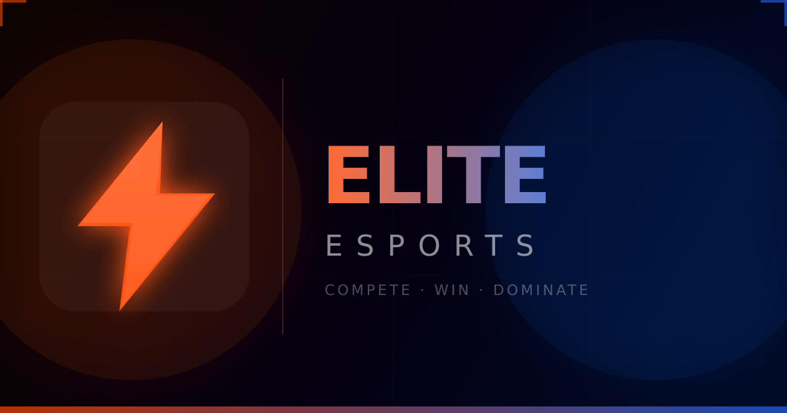
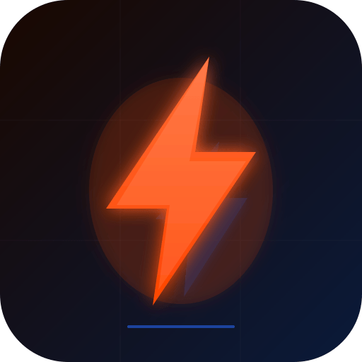

<div align="center">
  

  <br/>
  <br/>

  

  <h1>Elite Esports</h1>

  <p><strong>Compete · Win · Dominate</strong></p>

  <p>A premium mobile-first esports tournament platform — live matches, real-time leaderboards, and in-app wallet, all in one dark, fast, and beautiful app.</p>

  <br/>

  
  
  
  
  
  

</div>

---

## Table of Contents

- [Overview](#overview)
- [Features](#features)
- [Tech Stack](#tech-stack)
- [Color Palette](#color-palette)
- [Project Structure](#project-structure)
- [Getting Started](#getting-started)
- [Environment Variables](#environment-variables)
- [Scripts](#scripts)
- [Pages](#pages)
- [Contributing](#contributing)
- [License](#license)

---

## Overview

Elite Esports is a **premium global esports tournament platform** built as a mobile-first Progressive Web App (PWA). It delivers a native-grade experience with iOS-inspired dark UI, fluid animations, and real-time data — all from a single React codebase ready to export to React Native.

---

## Features

| Feature | Description |
|---|---|
| **Live Tournaments** | Browse, filter, and register for ongoing and upcoming matches |
| **Real-Time Leaderboard** | Global rankings with animated rank changes |
| **In-App Wallet** | Deposit, withdraw, and track transactions |
| **Player Profiles** | Customisable game profiles with stats and history |
| **Admin Panel** | Full tournament, user, economy, and campaign management |
| **Push Notifications** | In-app notification centre with unread badge |
| **AI Integration** | Google Gemini API-powered features |
| **PWA Ready** | Installable on iOS and Android from the browser |
| **Dark Mode** | iOS-inspired system-dark aesthetic throughout |

---

## Tech Stack

| Layer | Technology |
|---|---|
| Framework | [React 19](https://react.dev) + [TypeScript 5.8](https://typescriptlang.org) |
| Build Tool | [Vite 6](https://vitejs.dev) |
| Styling | [Tailwind CSS v4](https://tailwindcss.com) via `@tailwindcss/vite` |
| Routing | [React Router v7](https://reactrouter.com) |
| State | [Zustand v5](https://zustand-demo.pmnd.rs) |
| Animations | [Motion (Framer Motion) v12](https://motion.dev) |
| Icons | [Lucide React](https://lucide.dev) |
| AI | [Google Gemini API](https://ai.google.dev) (`@google/genai`) |
| HTTP | [Axios](https://axios-http.com) |

---

## Color Palette

The brand palette is inspired by the **Replit Agent** UI — aggressive orange-red for action, cool blue for depth.

| Role | Name | Hex | Preview |
|---|---|---|---|
| Primary | Orange-Red | `#FF4500` |  |
| Primary Light | Flame | `#FF6B35` |  |
| Secondary | Blue | `#2563EB` |  |
| Secondary Light | Sky Blue | `#3B82F6` |  |
| Success | Green | `#30D158` |  |
| Warning | Amber | `#FF9F0A` |  |
| Gold | Yellow | `#FFD60A` |  |
| App Background | Black | `#000000` |  |
| Card Surface | Dark Gray | `#1C1C1E` |  |

---

## Project Structure

```
elite-esports/
├── public/
│   ├── logo.png              # 512×512 app icon
│   ├── favicon.ico           # Multi-size browser icon (16, 32, 48px)
│   ├── og-icon.png           # 1200×630 social media preview
│   ├── apple-touch-icon.png  # 180×180 iOS home screen icon
│   └── manifest.json         # PWA manifest
├── src/
│   ├── components/
│   │   ├── common/           # Logo, shared atoms
│   │   ├── layout/           # Header, BottomBar, AdminLayout
│   │   ├── ui/               # Button, Card, Input, Tag, LetterAvatar
│   │   ├── matches/          # MatchCard and related
│   │   └── home/             # BannerCarousel
│   ├── pages/                # All route-level page components
│   ├── routes/               # AppRouter with role-based access
│   ├── store/                # Zustand stores (user, match, notification)
│   ├── utils/                # Helper functions (cn, formatters)
│   ├── types.ts              # Global TypeScript interfaces
│   ├── index.css             # Tailwind v4 theme & global styles
│   └── main.tsx              # App entry point
├── scripts/
│   └── generate-assets.mjs   # Logo/favicon/og-image generator
├── index.html
├── vite.config.ts
├── tsconfig.json
└── package.json
```

---

## Getting Started

### Prerequisites

- [Node.js](https://nodejs.org) v18 or higher
- npm v9 or higher

### Installation

```bash
# 1. Clone the repository
git clone https://github.com/your-username/elite-esports.git
cd elite-esports

# 2. Install dependencies
npm install

# 3. Copy the environment file
cp .env.example .env.local

# 4. Add your Gemini API key to .env.local
# GEMINI_API_KEY=your_key_here

# 5. Start the development server
npm run dev
```

The app will be available at `http://localhost:5000`.

---

## Environment Variables

| Variable | Required | Description |
|---|---|---|
| `GEMINI_API_KEY` | Optional | Google Gemini API key for AI-powered features |

---

## Scripts

| Command | Description |
|---|---|
| `npm run dev` | Start the Vite development server on port 5000 |
| `npm run build` | Build the production bundle to `dist/` |
| `npm run preview` | Preview the production build locally |
| `npm run lint` | Run TypeScript type-checking |
| `node scripts/generate-assets.mjs` | Regenerate all logo/favicon/og-image assets |

---

## Pages

### User-Facing
| Route | Page |
|---|---|
| `/` | Home — Banner carousel, match feed |
| `/leaderboard` | Global player rankings |
| `/live` | Live matches viewer |
| `/wallet` | Balance, deposits, withdrawals |
| `/profile` | Player profile & stats |
| `/match/:id` | Match detail & registration |
| `/notifications` | In-app notification centre |
| `/settings` | Account settings |

### Admin Panel
| Route | Page |
|---|---|
| `/admin` | Dashboard overview |
| `/admin/matches` | Tournament management |
| `/admin/users` | User management |
| `/admin/economy` | Deposits & withdrawals |
| `/admin/notifications` | Push notifications |
| `/admin/campaign` | Banners & promotions |
| `/admin/support` | Support tickets |

---

## Contributing

1. Fork the repository
2. Create a feature branch — `git checkout -b feature/your-feature`
3. Commit your changes — `git commit -m 'feat: add your feature'`
4. Push to the branch — `git push origin feature/your-feature`
5. Open a Pull Request

Please follow the existing code style and ensure TypeScript type-checking passes before opening a PR.

---

## License

This project is licensed under the **MIT License** — see the [LICENSE](LICENSE) file for details.

---

<div align="center">
  <p>Built with passion for the competitive gaming community.</p>
  <p>
    <strong>⚡ Elite Esports</strong> — Compete · Win · Dominate
  </p>
</div>
